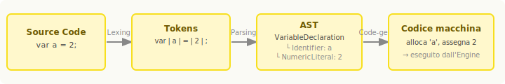
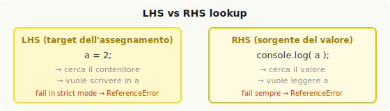
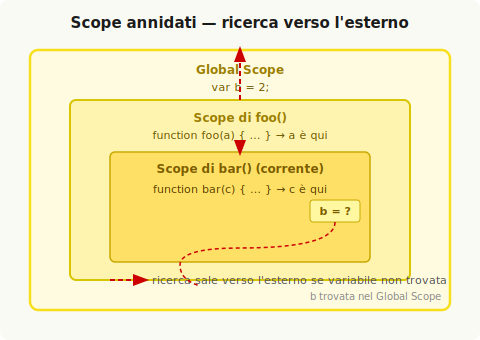

# Che cos'è lo Scope

La capacità di memorizzare valori nelle variabili e di recuperarli o modificarli in un secondo momento è uno dei paradigmi fondamentali di quasi tutti i linguaggi di programmazione. Senza questo meccanismo un programma potrebbe svolgere solo compiti elementari e statici.

Ma la presenza delle variabili apre subito domande più profonde: dove vivono queste variabili? Come il programma le trova quando ne ha bisogno? La risposta è: attraverso un insieme ben definito di regole chiamato **scope**.

## Compiler Theory

JavaScript viene spesso descritto come linguaggio interpretato, ma questa è una semplificazione imprecisa. JavaScript è di fatto un linguaggio **compilato** — non in anticipo come C o Java, e non in modo portabile tra sistemi diversi, ma compilato comunque: il JS engine compila il codice immediatamente prima (talvolta durante) l'esecuzione.

Un compiler tradizionale processa il codice sorgente attraverso tre fasi principali:



**Tokenizing / Lexing** — il codice sorgente viene scomposto in unità atomiche di significato chiamate **token**. Ad esempio, `var a = 2;` diventa: `var`, `a`, `=`, `2`, `;`. La distinzione tra tokenizing e lexing riguarda se il parser mantiene o meno uno stato durante il riconoscimento dei token — differenza rilevante per la comprensione del lexical scope.

**Parsing** — lo stream di token viene trasformato in un albero di elementi annidati che rappresenta la struttura grammaticale del programma: l'**AST** (Abstract Syntax Tree, albero sintattico astratto). Per `var a = 2;`, il nodo radice potrebbe essere un `VariableDeclaration`, con un figlio `Identifier` (valore: `a`) e un figlio `AssignmentExpression` che contiene un `NumericLiteral` (valore: `2`).

**Code-Generation** — l'AST viene convertito in istruzioni macchina eseguibili. Per `var a = 2;` questo significa: riservare memoria per una variabile denominata `a` e memorizzarvi il valore `2`.

Il JavaScript engine non dispone del lusso di compilare in anticipo come i linguaggi tradizionali. La compilazione avviene pochi microsecondi prima dell'esecuzione, il che obbliga l'engine a usare tecniche aggressive come la **JIT compilation** (Just-In-Time compilation — compilazione al momento dell'esecuzione con ottimizzazioni progressive).

La conclusione pratica è che qualsiasi frammento di JavaScript viene compilato prima di essere eseguito — e questo fatto ha conseguenze dirette su come lo scope funziona.

## Come funziona lo Scope

Per capire lo scope è utile modellare il processo come una conversazione tra tre attori:

- **Engine** — responsabile della compilazione end-to-end e dell'esecuzione del programma.
- **Compiler** — uno dei collaboratori dell'Engine: gestisce il parsing e la code-generation.
- **Scope** — un altro collaboratore: mantiene la lista di tutti gli identificatori dichiarati e applica le regole che governano la loro accessibilità.

### Come viene processato `var a = 2;`

Questo statement, che sembra un'unica operazione, viene in realtà trattato in due momenti distinti.

**Durante la compilazione** (Compiler + Scope):
1. Il Compiler incontra `var a` e chiede allo Scope se esiste già una variabile `a` in quello scope. Se sì, ignora la dichiarazione. Se no, chiede allo Scope di dichiararla.
2. Il Compiler produce il codice per l'assegnamento `a = 2`, che verrà eseguito in seguito dall'Engine.

**Durante l'esecuzione** (Engine + Scope):
1. L'Engine incontra il codice per `a = 2` e chiede allo Scope se esiste una variabile `a` accessibile nello scope corrente.
2. Se trovata, l'Engine assegna `2` ad `a`. Se non trovata, risale agli scope esterni (vedi Scope annidato).

### LHS e RHS lookup

Quando l'Engine cerca una variabile, il tipo di ricerca che esegue dipende dallo scopo:

- **LHS lookup** (Left-Hand Side) — cerca il **contenitore** della variabile per poterci scrivere. Si attiva quando la variabile è il **target** di un assegnamento.
- **RHS lookup** (Right-Hand Side) — cerca il **valore** corrente della variabile per leggerlo. Si attiva quando la variabile è la **sorgente** di un'operazione.



```js
a = 2;           // LHS: cerca il contenitore `a` per assegnarci 2
console.log(a);  // RHS: cerca il valore corrente di `a` per passarlo a log
```

La distinzione non è "letteralmente a sinistra o destra del `=`": è più preciso pensarla come "chi è il target?" (LHS) e "chi è la sorgente?" (RHS).

Consideriamo un esempio più articolato:

```js
function foo(a) {
    console.log(a); // 2
}

foo(2);
```

Qui avvengono più lookup in sequenza:
- RHS su `foo` → trova la funzione, la esegue
- LHS su `a` (parametro) → l'argomento `2` viene assegnato ad `a` (assegnamento implicito)
- RHS su `console` → trova l'oggetto console
- RHS su `a` → recupera il valore `2` da passare a `log`

### La "conversazione" tra Engine e Scope

Il flusso di lookup può essere visualizzato come un dialogo. Per il codice:

```js
function foo(a) {
    console.log(a); // 2
}
foo(2);
```

L'Engine chiede allo Scope: "Hai una variabile `foo`?" → "Sì, è una funzione." → L'Engine la esegue.
Poi: "Hai un parametro `a` per `foo`?" → "Sì." → L'Engine assegna `2` ad `a`.
Poi: "Hai `console`?" → "Sì, è built-in." → L'Engine cerca `log` su di esso.
Poi: "Hai ancora `a`?" → "Stessa variabile di prima, valore `2`." → Passa `2` a `log`.

> **Quiz** — nel seguente codice, quanti LHS e RHS lookup riesci a identificare?
> ```js
> function foo(a) {
>     var b = a;
>     return a + b;
> }
> var c = foo(2);
> ```
> LHS: 3 (`a = 2` implicito, `b = a`, `c = foo(2)`). RHS: 4 (`foo`, `a` per assegnare a `b`, `a` nel return, `b` nel return).

## Scope annidato

Nella realtà i programmi hanno più scope annidati uno nell'altro, esattamente come le funzioni possono essere annidate dentro altre funzioni. Quando l'Engine cerca una variabile e non la trova nello scope corrente, **risale** allo scope esterno, poi a quello ancora più esterno, fino al **global scope**. Se non la trova neanche lì, la ricerca si ferma.



```js
function foo(a) {
    console.log(a + b); // `b` non è in foo, viene cercata fuori
}

var b = 2;
foo(2); // 4
```

Il dialogo tra Engine e Scope sarebbe:
- "Hai `b` nello scope di `foo`?" → "No."
- "Hai `b` nel global scope?" → "Sì, vale `2`."

La regola di traversal è semplice: si parte dallo scope corrente e si sale di un livello alla volta. Al global scope ci si ferma sempre, trovata o meno la variabile.

## Errori: ReferenceError e TypeError

Il tipo di lookup (LHS o RHS) determina il comportamento quando una variabile non viene trovata.

**RHS lookup fallisce** → `ReferenceError` — la variabile non esiste in nessuno scope raggiungibile. L'Engine non può recuperare un valore che non esiste.

**LHS lookup fallisce**:
- In **non-strict mode** → il global scope crea automaticamente una variabile con quel nome e la restituisce all'Engine. Questo comportamento silenzioso è una delle fonti di bug più comuni in JavaScript.
- In **strict mode** → `ReferenceError`, stesso comportamento dell'RHS.

**RHS lookup riesce, ma l'operazione è illegale** → `TypeError` — la variabile è stata trovata ma non può essere usata nel modo richiesto (es. chiamare come funzione un valore che non è una funzione, accedere a una proprietà di `null` o `undefined`).

```js
function foo(a) {
    console.log(a + b); // RHS su `b` — non trovata → ReferenceError
    b = a;
}
foo(2);
```

La distinzione tra `ReferenceError` e `TypeError` è significativa: il primo segnala un fallimento della risoluzione dello scope; il secondo indica che la risoluzione è riuscita ma l'azione tentata sul valore è impossibile.

---

## ⚡ Ripasso veloce

**JavaScript è compilato** — il codice viene tokenizzato, parsato in AST e compilato in bytecode prima di essere eseguito. La compilazione avviene JIT, pochi microsecondi prima dell'esecuzione.

**Scope** = insieme di regole che governa dove e come una variabile può essere cercata e trovata.

**LHS vs RHS**: LHS cerca il contenitore per scrivere (target dell'assegnamento); RHS cerca il valore per leggerlo (sorgente).

```js
a = 2;           // LHS su `a`
console.log(a);  // RHS su `a`
```

**Scope annidati**: la ricerca parte dallo scope corrente e risale verso l'esterno fino al global scope.

**Errori**:
- RHS fallisce → sempre `ReferenceError`
- LHS fallisce in non-strict → variabile globale implicita (bug silenzioso)
- LHS fallisce in strict → `ReferenceError`
- Lookup OK, operazione illegale → `TypeError`

---

## Domande

<details>
<summary>Perché JavaScript viene definito un linguaggio compilato se viene eseguito nel browser senza una fase di build esplicita?</summary>

Perché compilazione non significa necessariamente "in anticipo" o "con un file binario separato". La compilazione è il processo di trasformazione del codice sorgente in istruzioni macchina, e il JavaScript engine la esegue ogni volta che incontra del codice da eseguire — spesso pochi microsecondi prima dell'esecuzione stessa (JIT compilation). Le tre fasi — tokenizing, parsing e code-generation — avvengono comunque. Capire questo è fondamentale per comprendere hoisting e scope.

</details>

<details>
<summary>Qual è la differenza tra un LHS lookup e un RHS lookup?</summary>

Un LHS lookup cerca il **contenitore** della variabile — il posto in cui scrivere un valore. Si attiva quando la variabile è il target di un assegnamento (`a = 2`). Un RHS lookup cerca il **valore** corrente della variabile — il dato da leggere e usare. Si attiva quando la variabile è la sorgente di un'operazione (`console.log(a)`). La distinzione è importante perché i due tipi di lookup hanno comportamenti diversi quando la variabile non viene trovata.

</details>

<details>
<summary>Cosa succede quando un LHS lookup fallisce in non-strict mode?</summary>

Il global scope crea automaticamente una nuova variabile con quel nome e la restituisce all'Engine, come se fosse sempre esistita. Questo comportamento silenzioso — detto "auto-global creation" — è una fonte di bug difficili da individuare, perché non produce alcun errore visibile. In strict mode invece il comportamento è identico a quello dell'RHS: viene lanciato un `ReferenceError`.

</details>

<details>
<summary>Qual è la differenza tra ReferenceError e TypeError?</summary>

Un `ReferenceError` segnala che il lookup nello scope è fallito — la variabile cercata non esiste in nessuno scope raggiungibile. Un `TypeError` invece indica che il lookup è riuscito — la variabile è stata trovata — ma l'operazione tentata sul valore recuperato è illegale o impossibile (es. chiamare come funzione un numero, accedere a una proprietà di `null`). Il `ReferenceError` è un problema di scope; il `TypeError` è un problema di tipo.

</details>

<details>
<summary>Come viene processata la dichiarazione `var a = 2;` dal compiler e dall'engine?</summary>

La dichiarazione viene divisa in due operazioni distinte. Durante la compilazione, il Compiler vede `var a` e chiede allo Scope di dichiarare la variabile `a` in quello scope (se non esiste già). Durante l'esecuzione, l'Engine incontra `a = 2`, esegue un LHS lookup per trovare il contenitore `a` nello scope, e vi assegna il valore `2`. Questa separazione — dichiarazione in fase di compilazione, assegnamento in fase di esecuzione — è precisamente il meccanismo che produce l'hoisting.

</details>
