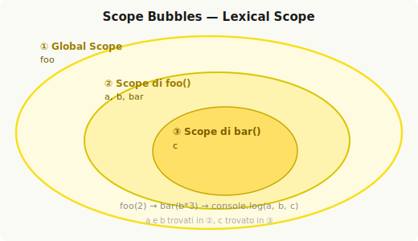

# Lexical Scope

Esistono due modelli principali per definire come funziona lo scope. Il primo, usato dalla grande maggioranza dei linguaggi di programmazione — JavaScript incluso — si chiama **lexical scope**. Il secondo, usato da linguaggi come Bash o alcune modalità di Perl, è il **dynamic scope**. Capire la differenza tra i due è utile per capire perché JavaScript si comporta come si comporta.

## Scope definito al momento della scrittura

Il lexical scope è scope definito al momento del **lexing** — la prima fase del processo di compilazione in cui il codice sorgente viene analizzato e scomposto in token. In termini pratici, il lexical scope è determinato da **dove le funzioni vengono dichiarate nel codice**, non da dove vengono chiamate.

Questa distinzione è fondamentale: nel momento in cui si scrive il codice — non quando viene eseguito — lo scope di ogni variabile è già fissato.

```js
function foo(a) {
    var b = a * 2;

    function bar(c) {
        console.log(a, b, c);
    }

    bar(b * 3);
}

foo(2); // 2, 4, 12
```

In questo esempio esistono tre scope annidati, spesso visualizzati come **bolle** (bubbles) concentriche:



- **Bolla ①** — Global scope: contiene solo `foo`
- **Bolla ②** — Scope di `foo()`: contiene `a`, `b`, `bar`
- **Bolla ③** — Scope di `bar()`: contiene solo `c`

Le bolle sono definite da **dove** le funzioni vengono dichiarate nel codice — non da dove vengono chiamate. `bar` è dichiarata dentro `foo`, quindi la bolla ③ è interamente contenuta nella bolla ②, che è a sua volta contenuta nella bolla ①. Non esistono bolle parzialmente sovrapposte.

### Lookup e shadowing

Quando l'engine esegue `console.log(a, b, c)` dentro `bar`, cerca le tre variabili partendo dallo scope più interno:

- `c` — trovata direttamente nello scope di `bar` (bolla ③). La ricerca si ferma.
- `a` — non trovata in `bar`, si risale a `foo`. Trovata. La ricerca si ferma.
- `b` — non trovata in `bar`, si risale a `foo`. Trovata. La ricerca si ferma.

La ricerca nello scope si ferma al **primo risultato** trovato. Se una variabile con lo stesso nome esiste in più scope annidati, quella dello scope più interno "nasconde" (shadow) quella esterna — meccanismo chiamato **shadowing**.

```js
var a = "globale";

function foo() {
    var a = "locale"; // shadowing della `a` globale
    console.log(a);   // "locale"
}

foo();
console.log(a); // "globale"
```

> Le variabili globali sono anche proprietà dell'oggetto globale (`window` nel browser). Una variabile globale oscurata da una locale rimane accessibile tramite `window.a`, ma le variabili locali oscurate non hanno questa via d'uscita.

Una regola importante: lo scope lessicale di una funzione dipende esclusivamente da **dove è dichiarata**, non da dove viene chiamata. Questo principio vale sempre, anche quando una funzione viene passata come argomento o restituita da un'altra funzione.

---

## Aggirare il lexical scope

Il lexical scope è un contratto stabilito al momento della scrittura del codice, prima dell'esecuzione. Esistono però due meccanismi in JavaScript che lo modificano a runtime. Entrambi sono **fortemente sconsigliati** — non solo per questioni di leggibilità, ma per un motivo tecnico preciso: degradano le prestazioni dell'engine.

### `eval()`

`eval()` accetta una stringa e la tratta come se fosse codice scritto direttamente in quel punto del programma. Se la stringa contiene dichiarazioni di variabili o funzioni, queste modificano lo scope lessicale del contesto in cui `eval()` viene chiamato:

```js
function foo(str, a) {
    eval(str);           // interpreta "var b = 3;" come codice
    console.log(a, b);
}

var b = 2;
foo("var b = 3;", 1); // 1, 3
```

La stringa `"var b = 3;"` crea una nuova `b` dentro lo scope di `foo`, che oscura la `b` globale. Il risultato è `1, 3` invece di `1, 2`.

In **strict mode**, `eval()` opera in un proprio scope isolato: le dichiarazioni al suo interno non contaminano lo scope circostante.

```js
function foo(str) {
    "use strict";
    eval(str);
    console.log(a); // ReferenceError: a non è definita
}
foo("var a = 2");
```

### `with`

`with` è un costrutto (oggi deprecato e proibito in strict mode) che prende un oggetto e lo tratta come se fosse un intero scope lessicale, rendendo le sue proprietà accessibili come identificatori:

```js
var obj = { a: 1, b: 2, c: 3 };

with (obj) {
    a = 3; // modifica obj.a
    b = 4; // modifica obj.b
    c = 5; // modifica obj.c
}
```

Il problema emerge quando l'oggetto passato non ha la proprietà cercata:

```js
function foo(obj) {
    with (obj) {
        a = 2; // LHS lookup: cerca `a` nello scope di obj, poi fuori
    }
}

var o1 = { a: 3 };
var o2 = { b: 3 };

foo(o1);
console.log(o1.a); // 2 — ok, ha trovato a in obj

foo(o2);
console.log(o2.a); // undefined — o2 non ha `a`
console.log(a);    // 2 — ATTENZIONE: variabile globale creata automaticamente!
```

Quando `with` non trova la proprietà `a` nell'oggetto, il LHS lookup risale agli scope esterni. In non-strict mode, se non la trova da nessuna parte, la crea nel global scope — esattamente come accade con le variabili non dichiarate.

### Perché degradano le prestazioni

Il JavaScript engine ottimizza il lookup delle variabili durante la fase di compilazione, analizzando staticamente il codice per sapere in anticipo dove si trova ogni identificatore. Quando incontra un `eval()` o un `with`, deve abbandonare queste ottimizzazioni perché non può sapere a compile-time cosa conterrà la stringa di `eval()` o le proprietà dell'oggetto passato a `with`. Il risultato è che tutto il codice in quello scope viene eseguito senza ottimizzazioni — indipendentemente da quanto `eval()` o `with` siano "innocui" nel caso specifico.

> Non usare `eval()` per eseguire codice generato dinamicamente, e non usare `with`. I casi d'uso legittimi sono praticamente inesistenti, e il costo in prestazioni è reale.

---

## ⚡ Ripasso veloce

**Lexical scope** = scope definito al momento della scrittura, da dove le funzioni sono dichiarate — non da dove vengono chiamate.

**Scope bubbles**: ogni funzione crea una bolla di scope. Le bolle si annidano strettamente, mai parzialmente sovrapposte.

**Lookup**: parte dallo scope più interno e risale verso l'esterno. Si ferma al primo risultato.

**Shadowing**: una variabile con lo stesso nome nello scope interno oscura quella esterna.

```js
var x = 1;
function f() {
    var x = 2;   // shadowing
    console.log(x); // 2 — trova prima questa
}
f();
console.log(x); // 1 — lo scope esterno non è stato toccato
```

**`eval()` e `with`** modificano lo scope lessicale a runtime → disabilitano le ottimizzazioni dell'engine → codice più lento. Non usarli.

---

## Domande

<details>
<summary>Cosa significa che il lexical scope è definito "al momento della scrittura"?</summary>

Significa che la struttura dello scope di ogni funzione è determinata da dove quella funzione è dichiarata nel codice sorgente, non da dove viene chiamata durante l'esecuzione. Quando il lexer analizza il codice, le relazioni tra gli scope sono già stabilite e non cambiano a runtime (salvo l'uso di `eval` o `with`). Questo permette all'engine di analizzare staticamente il codice e ottimizzare il lookup delle variabili prima dell'esecuzione.

</details>

<details>
<summary>Cos'è il shadowing e quali conseguenze ha?</summary>

Il shadowing avviene quando una variabile dichiarata in uno scope interno ha lo stesso nome di una variabile in uno scope esterno. Il lookup si ferma alla prima occorrenza trovata, partendo dallo scope più interno — quindi la variabile interna "oscura" quella esterna, che diventa inaccessibile con quel nome all'interno dello scope interno. Le variabili globali oscurate restano accessibili tramite `window.nome` nel browser; le variabili locali oscurate non hanno questa via d'uscita.

</details>

<details>
<summary>Perché `eval()` e `with` peggiorano le prestazioni anche quando non fanno nulla di "dannoso"?</summary>

L'engine ottimizza il lookup delle variabili durante la compilazione, determinando in anticipo la posizione esatta di ogni identificatore. Quando vede `eval()` o `with`, non può più fare questa analisi statica — non sa cosa conterrà la stringa di `eval` né quali proprietà avrà l'oggetto di `with` a runtime. Per sicurezza, disattiva le ottimizzazioni per l'intero scope in cui appaiono. Il costo si applica a tutto il codice in quello scope, non solo alla riga con `eval` o `with`.

</details>

<details>
<summary>Qual è la differenza tra `eval()` in strict mode e in non-strict mode?</summary>

In non-strict mode, le dichiarazioni fatte dentro `eval()` modificano lo scope lessicale del contesto circostante: una `var b` dentro `eval()` aggiunge `b` allo scope della funzione che ha chiamato `eval()`. In strict mode, `eval()` opera in uno scope isolato e privato: le dichiarazioni al suo interno non escono, e lo scope esterno rimane intatto.

</details>

<details>
<summary>Perché `with` può creare variabili globali accidentalmente?</summary>

Perché `with` tratta l'oggetto passato come uno scope lessicale temporaneo. Quando il codice dentro `with` fa un LHS lookup su un identificatore non presente come proprietà dell'oggetto, la ricerca risale agli scope esterni nel modo normale. Se non trova la variabile in nessuno scope e il programma è in non-strict mode, il global scope la crea automaticamente — esattamente come accade con le variabili non dichiarate. Questo comportamento silenzioso è una delle ragioni per cui `with` è proibito in strict mode e deprecato nel linguaggio.

</details>
