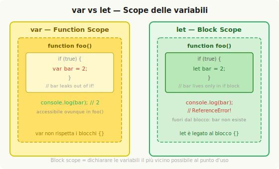

# Function Scope e Block Scope

Nel capitolo precedente si è visto che ogni scope forma una "bolla" di contenimento. La domanda naturale è: cosa esattamente crea una nuova bolla? Solo le funzioni? Esistono altri costrutti che generano il proprio scope?

## Scope dalle funzioni

La risposta più comune — e sostanzialmente corretta — è che JavaScript ha **function-based scope**: ogni funzione dichiarata crea la propria bolla di scope, e ogni identificatore dichiarato al suo interno appartiene a quella bolla, indipendentemente da dove nella funzione si trova la dichiarazione.

```js
function foo(a) {
    var b = 2;

    function bar() {
        // ...
    }

    var c = 3;
}
```

Lo scope di `foo` contiene `a`, `b`, `c` e `bar`. Questi identificatori non sono accessibili dall'esterno: tentare di chiamare `bar()` o accedere a `a`, `b`, `c` fuori da `foo` produce `ReferenceError`. All'interno di `foo`, invece, tutti questi identificatori sono visibili — e lo sono anche all'interno di `bar`, salvo che `bar` non dichiari propri shadowing.

### Hiding in Plain Scope

Il modo tradizionale di pensare alle funzioni è: si dichiara una funzione, poi si mette il codice dentro. Esiste però il modo inverso, altrettanto utile: si prende un blocco di codice già scritto e lo si avvolge in una funzione — operazione che "nasconde" quel codice dal resto del programma.

Questa tecnica ha radici nel principio di progettazione software noto come **Principle of Least Privilege** (o Least Exposure): un modulo o un'API dovrebbe esporre solo il minimo necessario, tenendo privato tutto il resto.

```js
/* versione con tutto esposto — fragile */
function doSomething(a) {
    b = a + doSomethingElse(a * 2);
    console.log(b * 3);
}

function doSomethingElse(a) {
    return a - 1;
}

var b;
doSomething(2); // 15
```

In questo snippet, sia `b` che `doSomethingElse` sono visibili globalmente, pur essendo dettagli implementativi di `doSomething`. Qualunque altra parte del codice potrebbe modificarli, violando le precondizioni di `doSomething`.

```js
/* versione corretta — dettagli nascosti */
function doSomething(a) {
    function doSomethingElse(a) {
        return a - 1;
    }

    var b;
    b = a + doSomethingElse(a * 2);
    console.log(b * 3);
}

doSomething(2); // 15
```

Ora `b` e `doSomethingElse` esistono solo dentro `doSomething`: il comportamento esterno è identico, ma il design è più robusto.

### Collision avoidance

Un altro vantaggio dello "scope come nascondimento" è evitare collisioni accidentali tra identificatori con lo stesso nome ma usi diversi. Un esempio classico:

```js
function foo() {
    function bar(a) {
        i = 3; // LHS su `i` — ma non è dichiarata localmente!
        console.log(a + i);
    }

    for (var i = 0; i < 10; i++) {
        bar(i * 2); // loop infinito: `bar` sovrascrive la `i` del for
    }
}
```

`bar` sovrascrive la `i` del ciclo `for`, creando un loop infinito. La soluzione è dichiarare una variabile locale dentro `bar`: `var i = 3` o `var j = 3`.

**Global namespaces.** Le librerie esterne spesso espongono un singolo oggetto globale (un **namespace**) che funge da contenitore per tutte le loro funzionalità, evitando di inquinare il global scope con decine di identificatori:

```js
var MyLibrary = {
    version: "1.0",
    doSomething: function() { /* ... */ },
    doAnotherThing: function() { /* ... */ }
};
```

**Module management.** I moderni sistemi di moduli (CommonJS, ES modules, bundler come webpack) risolvono lo stesso problema in modo più strutturato: nessuna libreria aggiunge identificatori al global scope; tutti gli import/export avvengono attraverso meccanismi espliciti che rispettano le regole dello scope lessicale.

---

## Funzioni come scope: IIFE

Si è visto che avvolgere codice in una funzione lo nasconde. Problema: la funzione stessa aggiunge il proprio nome nello scope esterno, e va poi chiamata esplicitamente.

```js
var a = 2;
function foo() {  // `foo` ora esiste nel global scope
    var a = 3;
    console.log(a); // 3
}
foo();            // va chiamata esplicitamente
console.log(a);   // 2
```

La soluzione è trasformare la dichiarazione di funzione in una **function expression** (espressione di funzione), avvolgendola in parentesi. La posizione della parola `function` nel statement è il criterio decisivo: se `function` è la prima parola, è una dichiarazione; altrimenti è un'espressione.

```js
var a = 2;
(function foo() {
    var a = 3;
    console.log(a); // 3
})();
console.log(a); // 2
```

Qui `foo` esiste solo dentro la funzione stessa — non nello scope esterno. Le parentesi `()` finali invocano immediatamente la funzione. Questo pattern si chiama **IIFE** (Immediately Invoked Function Expression — espressione di funzione invocata immediatamente).

### Function expression anonima vs named

Una function expression può non avere nome:

```js
setTimeout(function() {
    console.log("aspettato 1 secondo");
}, 1000);
```

Le **anonymous function expression** sono pratiche ma hanno tre svantaggi:

1. Nessun nome utile negli stack trace (debugging più difficile).
2. Se la funzione deve riferirsi a se stessa (ricorsione, unbind di un event listener), l'unica alternativa è l'obsoleto `arguments.callee`.
3. Il codice è meno auto-documentante.

La best practice è sempre fornire un nome:

```js
setTimeout(function timeoutHandler() {
    console.log("aspettato 1 secondo");
}, 1000);
```

### Varianti dell'IIFE

L'IIFE può ricevere argomenti, il che permette di passare riferimenti esterni con nomi locali chiari:

```js
var a = 2;
(function IIFE(global) {
    var a = 3;
    console.log(a);        // 3
    console.log(global.a); // 2
})(window);
```

Una variante utile protegge dall'overwriting accidentale di `undefined`:

```js
(function IIFE(undefined) {
    var a;
    if (a === undefined) {
        console.log("undefined è sicuro qui");
    }
})(); // nessun argomento passato → il parametro è davvero undefined
```

Il pattern **UMD** (Universal Module Definition) inverte l'ordine, passando la funzione da eseguire come argomento:

```js
(function IIFE(def) {
    def(window);
})(function def(global) {
    var a = 3;
    console.log(a);        // 3
    console.log(global.a); // 2
});
```

---

## Block scope

Molti linguaggi supportano il **block scope**: le variabili dichiarate in un blocco `{ }` appartengono a quel blocco e non esistono fuori. JavaScript storicamente non aveva questa funzionalità nativa per `var` — e questo ha generato confusione:

```js
for (var i = 0; i < 10; i++) {
    console.log(i);
}
// `i` è ancora accessibile qui — non è "del" for loop
console.log(i); // 10
```

L'intenzione è usare `i` solo dentro il loop, ma `var` la lega allo scope della funzione (o al global scope). Esistono però alcune eccezioni storiche, e poi la soluzione moderna con `let` e `const`.



### `with` (storico)

Come visto nel capitolo precedente, `with` crea un nuovo scope temporaneo legato alla durata dello statement. È block scope in senso tecnico — ma è deprecato e da non usare.

### `try/catch`

Fin da ES3, la clausola `catch` di un `try/catch` ha block scope: la variabile di errore dichiarata in `catch(err)` esiste solo all'interno di quel blocco.

```js
try {
    undefined(); // forza un'eccezione
} catch (err) {
    console.log(err); // funziona
}

console.log(err); // ReferenceError: `err` non trovata
```

Questa è la forma di block scope più antica e portabile in JavaScript.

### `let`

ES6 introduce `let`, che dichiara una variabile legata allo scope del **blocco** in cui si trova (qualsiasi coppia `{ }`), non allo scope della funzione circostante.

```js
var foo = true;

if (foo) {
    let bar = foo * 2;
    bar = something(bar);
    console.log(bar);
}

console.log(bar); // ReferenceError
```

È possibile creare un blocco esplicito per rendere il legame al block scope più evidente:

```js
if (foo) {
    { /* blocco esplicito */
        let bar = foo * 2;
        console.log(bar);
    }
}
```

**`let` e hoisting.** A differenza di `var`, le dichiarazioni con `let` non si propagano (non "hoistano") all'inizio del blocco: la variabile non è accessibile prima della sua riga di dichiarazione.

```js
{
    console.log(bar); // ReferenceError — non ancora dichiarata
    let bar = 2;
}
```

**Garbage collection.** Il block scope può aiutare l'engine a liberare memoria prima. Se un oggetto grande viene usato solo in una parte del codice, confinarlo in un blocco esplicito con `let` rende chiaro all'engine che può essere garbage collected dopo quel blocco:

```js
function process(data) { /* ... */ }

{
    let someReallyBigData = { /* ... */ };
    process(someReallyBigData);
} // someReallyBigData può essere raccolta qui

var btn = document.getElementById("my_button");
btn.addEventListener("click", function click(evt) {
    console.log("click");
}, false);
```

Senza il blocco esplicito, il closure del click handler tiene in vita l'intero scope — e con esso `someReallyBigData`.

**`let` nei loop.** `let` nell'header di un `for` non solo vincola `i` al corpo del loop, ma la **ricrea a ogni iterazione**, il che diventa fondamentale per il comportamento dei closure (approfondito nel Cap 5):

```js
for (let i = 0; i < 10; i++) {
    console.log(i);
}
console.log(i); // ReferenceError
```

### `const`

ES6 introduce anche `const`, che crea una variabile block-scoped il cui valore è fisso dopo l'assegnamento iniziale. Qualsiasi tentativo di riassegnazione produce un errore.

```js
if (true) {
    var a = 2;
    const b = 3;

    a = 3;  // ok
    b = 4;  // TypeError!
}

console.log(a); // 3
console.log(b); // ReferenceError — fuori dal blocco
```

---

## ⚡ Ripasso veloce

**Function scope** = ogni funzione crea una bolla di scope. Qualunque variabile o funzione dichiarata al suo interno è invisibile dall'esterno — utile per nascondere dettagli implementativi (Principle of Least Privilege).

**IIFE** = function expression invocata immediatamente. Evita di inquinare lo scope esterno con il nome della funzione.

```js
(function IIFE() {
    var privata = 42; // non raggiungibile dall'esterno
})();
```

**Block scope** = le variabili appartengono al blocco `{ }` in cui sono dichiarate, non alla funzione circostante.

```js
for (let i = 0; i < 3; i++) {
    // `i` esiste solo qui
}
console.log(i); // ReferenceError
```

**`var`** → function scope (o global).  
**`let` / `const`** → block scope, no hoist prima della dichiarazione, `const` è immutabile.  
**`try/catch`** → la variabile `err` in `catch` è block-scoped fin da ES3.

---

## Domande

<details>
<summary>Qual è la differenza pratica tra una function declaration e una function expression?</summary>

La distinzione dipende dalla posizione della parola `function` nel statement: se è la prima parola, è una dichiarazione; altrimenti è un'espressione. La differenza pratica è dove viene legato il nome: in una dichiarazione il nome viene aggiunto allo scope circostante; in una expression il nome (se presente) esiste solo all'interno della funzione stessa. Questo è il principio alla base dell'IIFE: avvolgere la funzione in parentesi la trasforma in un'espressione, impedendo che il nome inquini lo scope esterno.

</details>

<details>
<summary>Cosa significa "function scope" e come si usa per nascondere dettagli implementativi?</summary>

In JavaScript ogni funzione crea un proprio scope: tutto ciò che viene dichiarato al suo interno (variabili e funzioni annidate) è invisibile all'esterno. Si può sfruttare questa proprietà avvolgendo codice "privato" in una funzione contenitore, in modo che rimanga inaccessibile al resto del programma. Questo riflette il Principle of Least Privilege: esporre solo ciò che è strettamente necessario, nascondere tutto il resto. Un modulo che espone un'unica funzione pubblica ma tiene all'interno le proprie variabili di supporto e le funzioni ausiliarie è un esempio tipico.

</details>

<details>
<summary>Perché le anonymous function expression sono sconsigliate rispetto alle named?</summary>

Le function expression anonime non hanno un nome associato, il che comporta tre problemi: nessun nome significativo appare negli stack trace quando si fa debugging; non è possibile riferirsi alla funzione stessa senza `arguments.callee` (deprecato), il che rende impossibile la ricorsione o lo sbinding di event listener; il codice è meno auto-documentante. Aggiungere un nome a una function expression risolve tutti e tre i problemi senza nessuno svantaggio concreto.

</details>

<details>
<summary>Qual è la differenza tra `var` e `let` rispetto allo scope?</summary>

`var` dichiara una variabile legata allo scope della funzione più vicina (o al global scope se non è dentro nessuna funzione): i blocchi `if`, `for`, `while` e simili non creano un nuovo scope per `var`. `let` dichiara invece una variabile legata allo scope del blocco `{ }` in cui si trova, anche se quel blocco è un `if` o il corpo di un `for`. Inoltre `let` non "hoista" la dichiarazione all'inizio del blocco: la variabile non è accessibile prima della riga in cui è dichiarata (TDZ — Temporal Dead Zone).

</details>

<details>
<summary>Perché `let` in un `for` loop è diverso da `var` quando si usano closure?</summary>

Con `var`, il ciclo `for` crea una sola variabile `i` legata allo scope della funzione: tutte le eventuali closure create all'interno del loop condividono la stessa `i`, e al momento della loro esecuzione `i` ha già raggiunto il valore finale. Con `let`, il runtime crea una nuova istanza di `i` per ogni iterazione del loop: ogni closure cattura la propria copia del valore corrente di `i`, non un riferimento condiviso. Questo comportamento è la soluzione naturale al classico bug dei closure in loop, che con `var` richiedeva un IIFE per aggirarlo.

</details>
