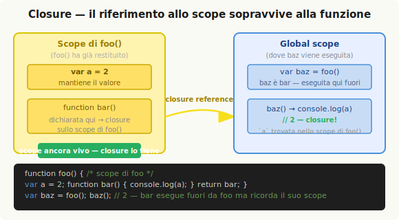

# Scope Closure

Il closure è uno degli aspetti più fraintesi di JavaScript — e anche uno dei più potenti. Non si tratta di una funzionalità speciale da imparare separatamente: è una conseguenza naturale e quasi inevitabile del modo in cui si scrive codice in un linguaggio con lexical scope. Chi conosce bene lo scope arriva al closure quasi per inerzia.

## Definizione

Il closure si verifica quando **una funzione è in grado di ricordare e accedere al proprio lexical scope anche quando viene eseguita al di fuori di esso**.

```js
function foo() {
    var a = 2;

    function bar() {
        console.log(a); // 2
    }

    return bar;
}

var baz = foo();
baz(); // 2 — questo è il closure
```

`bar` ha lexical scope access alla variabile `a` dentro `foo`. Quando `foo()` viene eseguita, restituisce la funzione `bar` come valore. Poi `foo()` termina — normalmente ci si aspetterebbe che il suo scope interno venga liberato dal garbage collector. Ma non è così: `bar` mantiene un **riferimento** a quello scope, e quel riferimento si chiama closure. Quando `baz()` viene invocata (settimane dopo, millisecondi dopo — non importa), ha ancora accesso a `a`.



La funzione può essere trasportata e invocata ovunque: il closure la accompagna sempre.

```js
function foo() {
    var a = 2;

    function baz() {
        console.log(a); // 2
    }

    bar(baz);
}

function bar(fn) {
    fn(); // closure osservato — baz "vede" ancora `a`
}
```

Anche in modo indiretto, assegnando la funzione a una variabile esterna:

```js
var fn;

function foo() {
    var a = 2;
    function baz() { console.log(a); }
    fn = baz;
}

function bar() {
    fn(); // 2 — ancora closure
}

foo();
bar();
```

In tutti questi casi, la funzione interna porta con sé un riferimento vivo allo scope in cui è stata dichiarata — indipendentemente da dove viene eseguita.

---

## Il closure nei callback

Il closure è già presente in quasi tutto il codice JavaScript scritto quotidianamente, anche quando non lo si riconosce esplicitamente.

```js
function wait(message) {
    setTimeout(function timer() {
        console.log(message); // closure su `message`
    }, 1000);
}

wait("Ciao, closure!");
```

`timer` viene passata a `setTimeout` e verrà eseguita un secondo dopo che `wait()` ha già terminato la propria esecuzione. Eppure ha ancora accesso a `message` — perché ha un closure sullo scope di `wait`.

Lo stesso vale per event handler, chiamate Ajax, web worker, e qualsiasi altro pattern asincrono: ogni volta che si passa una funzione (callback) che accede a variabili del proprio scope circostante, il closure è in azione.

> Un IIFE non è tecnicamente un esempio di closure *osservato*: la funzione viene eseguita nello stesso scope in cui è dichiarata, quindi `a` viene trovata tramite il normale lookup lessicale, non tramite un closure su uno scope esterno. Gli IIFE *creano* scope su cui si può formare un closure — ma non ne esercitano uno da soli.

---

## Il problema classico: loop e closure

Il loop `for` è l'esempio canonico che rivela come il closure funzioni davvero — e dove si nasconde il trabocchetto.

```js
for (var i = 1; i <= 5; i++) {
    setTimeout(function timer() {
        console.log(i);
    }, i * 1000);
}
```

L'intenzione è stampare `1`, `2`, `3`, `4`, `5` a intervalli di un secondo. L'output effettivo è `6`, cinque volte.

Il motivo: tutte e cinque le callback di `setTimeout` hanno un closure sulla **stessa** variabile `i`, che appartiene allo scope della funzione (o al global scope). Quando le callback vengono eseguite — dopo che il loop è già terminato — `i` vale già `6`. Non esiste nessuna copia separata di `i` per ogni iterazione.

### Soluzione con IIFE

Per risolvere serve uno scope separato per ogni iterazione, con una propria copia del valore:

```js
for (var i = 1; i <= 5; i++) {
    (function(j) {
        setTimeout(function timer() {
            console.log(j); // closure su `j`, diverso per ogni iterazione
        }, j * 1000);
    })(i);
}
```

L'IIFE crea un nuovo scope per ogni iterazione e riceve `i` come parametro `j`. Ogni callback forma un closure su una `j` distinta — il problema è risolto.

### Soluzione con `let`

`let` in un header `for` crea una nuova variabile per ogni iterazione del loop — esattamente ciò di cui si ha bisogno:

```js
for (let i = 1; i <= 5; i++) {
    setTimeout(function timer() {
        console.log(i); // ogni callback chiude su una `i` diversa
    }, i * 1000);
}
// stampa: 1, 2, 3, 4, 5 — corretto
```

Block scope e closure cooperano: `let` garantisce che ogni iterazione abbia la propria copia di `i`, su cui la callback forma il proprio closure.

---

## Il module pattern

Il closure abilita un pattern architetturale fondamentale: il **module** (modulo). Un modulo è una funzione che:

1. Mantiene variabili e funzioni "private" nel proprio scope.
2. Restituisce un oggetto (la **public API**) con riferimenti alle funzioni interne — che hanno closure sullo stato privato.

```js
function CoolModule() {
    var something = "cool";
    var another = [1, 2, 3];

    function doSomething() {
        console.log(something);
    }

    function doAnother() {
        console.log(another.join(" ! "));
    }

    return {
        doSomething: doSomething,
        doAnother: doAnother
    };
}

var foo = CoolModule();
foo.doSomething(); // "cool"
foo.doAnother();   // "1 ! 2 ! 3"
```

`something` e `another` non sono accessibili dall'esterno — sono privati. `doSomething` e `doAnother` le raggiungono grazie al closure sullo scope di `CoolModule`. L'oggetto restituito è la surface pubblica del modulo. Questo pattern si chiama **revealing module** (modulo che rivela).

**Due requisiti fondamentali** perché un modulo funzioni:

- La funzione esterna deve essere **invocata almeno una volta** (ogni invocazione crea una nuova istanza del modulo con il proprio stato privato).
- La funzione esterna deve **restituire almeno una funzione interna** con closure sullo stato privato.

Un oggetto con sole proprietà dati non è un modulo — non c'è closure.

### Singleton

Per ottenere una singola istanza si usa un IIFE:

```js
var foo = (function CoolModule() {
    var something = "cool";

    function doSomething() { console.log(something); }

    return { doSomething: doSomething };
})();

foo.doSomething(); // "cool"
```

### Mutare la public API dall'interno

Mantenendo un riferimento interno all'oggetto API è possibile modificarlo a runtime:

```js
var foo = (function CoolModule(id) {
    function identify1() { console.log(id); }
    function identify2() { console.log(id.toUpperCase()); }

    function change() {
        publicAPI.identify = identify2; // modifica la API dall'interno
    }

    var publicAPI = { change: change, identify: identify1 };
    return publicAPI;
})("foo module");

foo.identify(); // "foo module"
foo.change();
foo.identify(); // "FOO MODULE"
```

### Module manager

I sistemi di gestione dipendenze (come CommonJS o AMD) implementano essenzialmente lo stesso pattern in modo sistematizzato: una funzione `define` che avvolge ogni modulo e una `get` che restituisce le istanze:

```js
var MyModules = (function Manager() {
    var modules = {};

    function define(name, deps, impl) {
        for (var i = 0; i < deps.length; i++) {
            deps[i] = modules[deps[i]];
        }
        modules[name] = impl.apply(impl, deps);
    }

    function get(name) {
        return modules[name];
    }

    return { define: define, get: get };
})();
```

Non c'è nulla di magico: `define` invoca la funzione wrapper con le dipendenze risolte e salva il risultato (la public API) nella mappa interna.

---

## ES6 modules

ES6 introduce supporto nativo per i moduli a livello di sintassi. Ogni file è trattato come un modulo separato con il proprio scope chiuso. Le parole chiave `import` ed `export` permettono di dichiarare cosa è pubblico e cosa è privato in modo statico — il compiler può verificare i riferimenti a compile-time anziché a runtime.

```js
/* bar.js */
function hello(who) {
    return "Salve: " + who;
}
export { hello };

/* foo.js */
import { hello } from "bar";

var hungry = "hippo";
function awesome() {
    console.log(hello(hungry).toUpperCase());
}
export { awesome };

/* main.js */
import { hello } from "bar";
import { awesome } from "foo";

console.log(hello("rhino")); // "Salve: rhino"
awesome();                   // "SALVE: HIPPO"
```

A differenza dei module pattern function-based — le cui API sono dinamiche e modificabili a runtime — le ES6 module API sono **statiche**: la struttura delle esportazioni è fissa al momento della compilazione. L'engine può quindi rilevare riferimenti inesistenti come errori precoci (compile-time) invece di scoprirli solo a runtime.

Il contenuto di ogni file modulo è trattato come se fosse racchiuso in un closure, esattamente come i function-based module.

---

## ⚡ Ripasso veloce

**Closure** = una funzione che ricorda il proprio lexical scope anche quando eseguita fuori da esso.

```js
function makeCounter() {
    var count = 0;
    return function() {
        count++;
        return count;
    };
}

var counter = makeCounter();
counter(); // 1
counter(); // 2
counter(); // 3 — `count` vive grazie al closure
```

**Loop + closure**: con `var` tutte le callback condividono la stessa variabile → usare `let` (o IIFE) per creare uno scope separato per iterazione.

**Module pattern**: funzione esterna invocata che restituisce una public API con closure sullo stato privato. Due requisiti: funzione esterna invocata + almeno una funzione interna restituita.

```js
var modulo = (function() {
    var privato = 42;
    return {
        leggi: function() { return privato; }
    };
})();

modulo.leggi(); // 42 — closure su `privato`
```

---

## Domande

<details>
<summary>Cos'è esattamente il closure e quando si forma?</summary>

Il closure si forma quando una funzione interna viene definita all'interno di un'altra funzione e mantiene un riferimento vivo allo scope della funzione esterna — anche dopo che la funzione esterna ha terminato la propria esecuzione. Non è un meccanismo separato: è una conseguenza diretta del lexical scope. Ogni volta che si crea una funzione che accede a variabili del proprio scope circostante e la si trasporta fuori da quello scope (passandola come callback, restituendola, assegnandola a una variabile esterna), si sta esercitando un closure.

</details>

<details>
<summary>Perché il classico loop con `var` e `setTimeout` stampa sempre l'ultimo valore?</summary>

Perché `var` non crea un nuovo scope per ogni iterazione del loop: dichiara una singola variabile `i` nello scope della funzione circostante (o nel global scope). Tutte le callback di `setTimeout` hanno un closure sulla stessa `i`. Quando vengono eseguite — dopo che il loop è già terminato — `i` ha già raggiunto il valore finale (6 in un loop 1-5). Non esiste nessuna copia separata del valore per ogni iterazione. La soluzione è creare uno scope separato per ogni iterazione: con un IIFE che cattura il valore corrente come parametro, o con `let` che garantisce una nuova variabile per ogni iterazione del loop.

</details>

<details>
<summary>Quali sono i due requisiti del module pattern?</summary>

Il modulo richiede: 1) una funzione esterna che viene invocata almeno una volta — è questa invocazione a creare lo scope privato e il closure; 2) la funzione esterna deve restituire almeno una funzione interna che ha closure sullo scope privato. Senza il primo requisito non si crea lo scope; senza il secondo non si osserva il closure. Un oggetto con sole proprietà dati non costituisce un modulo nel senso closure-based del termine: serve almeno una funzione che chiuda sullo stato interno.

</details>

<details>
<summary>Qual è la differenza tra i function-based module e gli ES6 module?</summary>

I function-based module sono pattern runtime: le loro API sono oggetti dinamici, modificabili durante l'esecuzione — è possibile aggiungere, rimuovere o cambiare metodi esposti a runtime. Gli ES6 module hanno API statiche: la struttura delle esportazioni è dichiarata esplicitamente con `export` ed è fissa al momento della compilazione. Questo permette all'engine di verificare i riferimenti a compile-time e lanciare errori precoci se si importa qualcosa che non esiste. Inoltre ogni file ES6 module ha implicitamente il proprio scope chiuso, senza bisogno di avvolgere il codice in una funzione.

</details>

<details>
<summary>Un IIFE costituisce un esempio di closure?</summary>

Non nel senso stretto della definizione. Il closure richiede che una funzione venga eseguita *fuori* dal proprio lexical scope. In un IIFE la funzione viene dichiarata e immediatamente invocata nello stesso scope — le variabili esterne sono raggiunte tramite il normale lookup lessicale, non tramite un closure su uno scope esterno. Detto questo, gli IIFE *creano* scope su cui è possibile formare closure — e sono spesso usati proprio per questo scopo (come nel pattern del loop con IIFE). Sono quindi strettamente correlati al closure, anche se non lo esercitano da soli.

</details>
