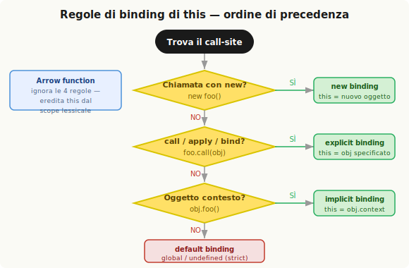

# this in pratica

Il capitolo precedente ha stabilito il principio: `this` è un binding creato al momento dell'invocazione, determinato dal call-site. Questo capitolo presenta le quattro regole che governano quel binding, il loro ordine di precedenza, le eccezioni, e il caso speciale delle arrow function.

## Il call-site e il call-stack

Il **call-site** è il punto nel codice da cui una funzione viene chiamata — non dove è dichiarata. Per trovarlo si deve guardare il **call-stack** (la catena di funzioni invocate fino al momento corrente) e prendere la funzione immediatamente prima di quella in esecuzione.

```js
function baz() {
    /* call-stack: baz — call-site è il global scope */
    bar(); // call-site di bar
}
function bar() {
    /* call-stack: baz → bar — call-site è baz */
    foo(); // call-site di foo
}
function foo() {
    /* call-stack: baz → bar → foo — call-site è bar */
}
baz(); // call-site di baz
```

Il debugger del browser mostra il call-stack direttamente: impostare un breakpoint e guardare la seconda voce dall'alto indica il call-site reale della funzione corrente.

---

## Le quattro regole



### Regola 1 — Default binding

Quando una funzione viene chiamata come **funzione libera** (senza contesto, senza `new`, senza `call`/`apply`/`bind`), si applica il default binding: `this` è il **global object** (in non-strict mode) o `undefined` (in strict mode).

```js
function foo() {
    console.log(this.a);
}
var a = 2;
foo(); // 2 — this è il global object, `a` è una sua proprietà
```

```js
function foo() {
    "use strict";
    console.log(this.a);
}
var a = 2;
foo(); // TypeError: this è undefined
```

La distinzione strict/non-strict si basa sul contenuto della funzione invocata, non sul call-site: anche se il call-site è in un contesto strict, se la funzione stessa non lo è, il global object rimane eligibile.

### Regola 2 — Implicit binding

Se il call-site ha un **oggetto contesto** — cioè la funzione è chiamata come metodo di un oggetto — `this` è quell'oggetto.

```js
function foo() {
    console.log(this.a);
}
var obj = { a: 2, foo: foo };
obj.foo(); // 2 — this è obj
```

Solo il livello più interno della catena di oggetti conta:

```js
var obj2 = { a: 42, foo: foo };
var obj1 = { a: 2, obj2: obj2 };
obj1.obj2.foo(); // 42 — this è obj2, non obj1
```

**Perdita dell'implicit binding.** È il problema più frequente. Quando un metodo viene estratto dall'oggetto e assegnato a una variabile, il call-site diventa una chiamata libera — e si applica il default binding:

```js
var bar = obj.foo; // bar è solo un riferimento alla funzione
var a = "oops, global";
bar(); // "oops, global" — this è il global object
```

Lo stesso accade quando si passa un metodo come callback:

```js
function doFoo(fn) {
    fn(); // call-site: funzione libera → default binding
}
doFoo(obj.foo); // "oops, global"
setTimeout(obj.foo, 100); // "oops, global" — setTimeout chiama fn()
```

Il passaggio di `obj.foo` come argomento è un assegnamento implicito: `fn` è un riferimento alla funzione, non al metodo. Il contesto `obj` viene perso.

### Regola 3 — Explicit binding

Per forzare `this` a un oggetto specifico senza aggiungergli una reference alla funzione, si usano `call()` e `apply()`. Entrambi ricevono come primo argomento l'oggetto a cui legare `this`:

```js
function foo() {
    console.log(this.a);
}
var obj = { a: 2 };
foo.call(obj);  // 2 — this è obj
foo.apply(obj); // 2 — identico per questo scopo
```

Se si passa un primitivo (`string`, `number`, `boolean`), viene automaticamente convertito nell'oggetto wrapper corrispondente (**boxing**).

**Hard binding.** L'explicit binding da solo non risolve il problema della perdita del contesto nelle callback. La soluzione è avvolgere la chiamata in una funzione che forza sempre lo stesso `this`:

```js
var bar = function() {
    foo.call(obj); // this è sempre obj, qualunque cosa succeda
};
bar();               // 2
setTimeout(bar, 100); // 2
bar.call(window);    // 2 — non si può sovrascrivere
```

Questo pattern è disponibile nativamente come `Function.prototype.bind()` (ES5):

```js
var bar = foo.bind(obj);
bar(3);           // this.a = 2, argomento = 3
console.log(bar); // funzione hard-bound a obj
```

`bind()` restituisce una nuova funzione con `this` permanentemente legato all'oggetto specificato.

**API context parameter.** Molte funzioni native (come `forEach`, `map`, `filter`) accettano un secondo parametro opzionale che funge da `this` per il callback — equivalente a usare `bind()`:

```js
function foo(el) {
    console.log(el, this.id);
}
var obj = { id: "awesome" };
[1, 2, 3].forEach(foo, obj); // 1 awesome  2 awesome  3 awesome
```

### Regola 4 — new binding

In JavaScript, `new` non istanzia una classe — esegue una **constructor call**: qualsiasi funzione può essere chiamata con `new` davanti, e in quel caso si verificano quattro cose automaticamente:

1. Viene creato un nuovo oggetto.
2. Il nuovo oggetto viene collegato tramite `[[Prototype]]` (dettaglio approfondito nel Cap 5).
3. Il nuovo oggetto viene impostato come `this` per quella chiamata.
4. La funzione restituisce il nuovo oggetto (a meno che non restituisca esplicitamente un altro oggetto).

```js
function foo(a) {
    this.a = a; // this è il nuovo oggetto creato
}
var bar = new foo(2);
console.log(bar.a); // 2
```

---

## Ordine di precedenza

Quando più regole potrebbero applicarsi, la precedenza è:

```
new binding  >  explicit binding  >  implicit binding  >  default binding
```

Per determinare `this` si scorrono queste domande in ordine:

1. La funzione è chiamata con `new`? → `this` è il nuovo oggetto.
2. La funzione è chiamata con `call`, `apply`, o `bind`? → `this` è l'oggetto specificato.
3. La funzione è chiamata come metodo di un oggetto contesto? → `this` è quell'oggetto.
4. Nessuna delle precedenti → default: global object (o `undefined` in strict mode).

**`new` può sovrascrivere hard binding.** Il `bind()` nativo, a differenza di un'implementazione manuale, consente a `new` di sovrascrivere il binding fisso — utile per la partial application:

```js
function foo(p1, p2) { this.val = p1 + p2; }

var bar = foo.bind(null, "p1"); // this non interessa, currying di p1
var baz = new bar("p2");
baz.val; // "p1p2"
```

---

## Eccezioni e casi particolari

### `null` e `undefined` come `this`

Passare `null` o `undefined` a `call`, `apply`, o `bind` equivale a non passare nulla: si applica il default binding. Il pattern comune è usare `null` come placeholder quando `this` non interessa (spread di array, currying):

```js
function foo(a, b) { console.log("a:" + a + ", b:" + b); }

foo.apply(null, [2, 3]); // a:2, b:3
var bar = foo.bind(null, 2);
bar(3); // a:2, b:3
```

**Rischio**: se la funzione usa `this` internamente, passare `null` può causare modifiche accidentali al global object. La pratica più sicura è usare un oggetto vuoto come **DMZ** (De-Militarized Zone — oggetto completamente neutro):

```js
var ø = Object.create(null); // più vuoto di {}, nessun prototype
foo.apply(ø, [2, 3]);
var bar = foo.bind(ø, 2);
```

### Riferimenti indiretti

Un assegnamento che sembra passare un metodo in realtà crea un riferimento diretto alla funzione — il contesto viene perso:

```js
var o = { a: 3, foo: foo };
var p = { a: 4 };
o.foo(); // 3 — implicit binding su o
(p.foo = o.foo)(); // 2 — il risultato dell'assegnamento è foo stessa: default binding
```

---

## Arrow function e lexical `this`

Le arrow function (`=>`) ignorano completamente le quattro regole. Al posto del binding dinamico, adottano il `this` dello **scope lessicale in cui sono dichiarate** — e questa associazione è immutabile, anche con `new`.

```js
function foo() {
    return (a) => {
        console.log(this.a); // this ereditato da foo al momento della sua chiamata
    };
}
var obj1 = { a: 2 };
var obj2 = { a: 3 };

var bar = foo.call(obj1);
bar.call(obj2); // 2 — non 3! this è fisso su obj1
```

Il caso d'uso tipico è nei callback asincroni, dove si vuole mantenere il `this` del contesto circostante:

```js
function foo() {
    setTimeout(() => {
        console.log(this.a); // this ereditato da foo
    }, 100);
}
var obj = { a: 2 };
foo.call(obj); // 2
```

Il pattern pre-ES6 equivalente era `var self = this` — entrambi risolvono il problema aggirando il meccanismo di `this` invece di usarlo correttamente. Se si usa spesso `self = this` o arrow function per "correggere" il binding, è probabilmente il segnale di una scelta di design: conviene scegliere tra stile lessicale (scope + closure) e stile `this` in modo coerente, senza mischiarli nella stessa funzione.

---

## ⚡ Ripasso veloce

Quattro domande da fare al call-site, in ordine di priorità:

| Priorità | Invocazione | Regola | `this` |
|----------|------------|--------|--------|
| 1 | `new foo()` | new binding | nuovo oggetto |
| 2 | `foo.call(obj)` / `foo.bind(obj)()` | explicit binding | `obj` |
| 3 | `obj.foo()` | implicit binding | `obj` |
| 4 | `foo()` | default binding | global / `undefined` |

```js
function foo() { console.log(this.a); }

var obj = { a: 2, foo: foo };
var a = "global";

obj.foo();          // 2   — implicit
foo.call(obj);      // 2   — explicit
var bar = new foo(); // costruisce un oggetto — new
foo();              // "global" — default
```

**Arrow function**: eredita `this` dal proprio scope lessicale — le 4 regole non si applicano.

---

## Domande

<details>
<summary>Qual è l'ordine di precedenza delle quattro regole di binding di `this`?</summary>

La precedenza, dalla più alta alla più bassa, è: new binding > explicit binding (call/apply/bind) > implicit binding (metodo su oggetto) > default binding (funzione libera). Per determinare `this` si scorre l'elenco dall'alto: se la funzione è chiamata con `new`, `this` è il nuovo oggetto costruito; se è chiamata con `call`, `apply`, o `bind`, `this` è l'oggetto esplicitamente specificato; se è chiamata come metodo di un oggetto, `this` è quell'oggetto; altrimenti si applica il default (global object in non-strict mode, `undefined` in strict mode).

</details>

<details>
<summary>Cos'è la "perdita dell'implicit binding" e perché è un problema frequente?</summary>

Avviene quando una funzione originariamente associata a un oggetto viene estratta da esso e invocata come funzione libera. L'estrazione — sia tramite assegnamento a variabile (`var bar = obj.foo`) sia tramite passaggio come callback (`doFoo(obj.foo)`, `setTimeout(obj.foo, 100)`) — crea un semplice riferimento alla funzione, senza il contesto dell'oggetto. Il call-site diventa una chiamata libera, e si applica il default binding. È un problema frequente perché l'intenzione del codice sembra preservare il contesto, ma il meccanismo di `this` segue il call-site, non l'origine del riferimento.

</details>

<details>
<summary>Qual è la differenza tra `call`/`apply` e `bind`?</summary>

`call` e `apply` invocano immediatamente la funzione con il `this` specificato come primo argomento. La differenza tra loro riguarda i parametri successivi: `call` li riceve come argomenti separati, `apply` come array. `bind` invece non invoca la funzione: restituisce una nuova funzione con il `this` permanentemente fissato (hard binding). Qualsiasi successiva invocazione della funzione restituita da `bind` — anche tramite `call`, `apply`, o come metodo di un oggetto — mantiene il binding fisso. Solo `new` può sovrascrivere un hard binding (nel `bind` nativo ES5, non in implementazioni manuali).

</details>

<details>
<summary>Perché passare `null` a `call`/`apply`/`bind` può essere pericoloso?</summary>

Perché `null` e `undefined` come `this` vengono trattati come se non ci fosse nessun binding: si applica il default binding, che in non-strict mode punta al global object. Se la funzione a cui si passa `null` usa internamente `this` — anche una funzione di terze parti su cui non si ha controllo — rischia di accedere o modificare il global object accidentalmente, creando bug difficili da rintracciare. La pratica più sicura è usare come placeholder un oggetto completamente vuoto (`var ø = Object.create(null)`), che non ha prototype e non può causare effetti collaterali sul global scope.

</details>

<details>
<summary>In cosa differisce il `this` nelle arrow function rispetto alle funzioni normali?</summary>

Le arrow function non hanno un proprio `this` binding: ignorano completamente le quattro regole standard. Il loro `this` è quello dello **scope lessicale** in cui sono dichiarate — cioè il `this` della funzione (o del contesto globale) che le contiene al momento della loro definizione. Una volta stabilito, questo binding è immutabile: `call`, `apply`, `bind`, e persino `new` non possono sovrascriverlo. Questo le rende utili nei callback asincroni dove si vuole mantenere il `this` del contesto circostante, ma le rende inappropriate per metodi di oggetti o funzioni che richiedono un `this` dinamico.

</details>
