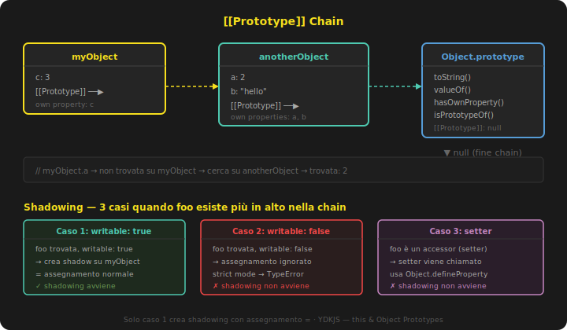

# Prototipi

Il meccanismo `[[Prototype]]` è il cuore di JavaScript: capirlo significa capire davvero il linguaggio. I capitoli 3 e 4 hanno menzionato la prototype chain più volte; qui viene esaminata in dettaglio.

## `[[Prototype]]`

Ogni oggetto in JavaScript ha una proprietà interna denominata `[[Prototype]]` dalla specifica, che è semplicemente un riferimento a un altro oggetto. Quasi tutti gli oggetti ricevono un valore non-null per questa proprietà al momento della creazione.

L'operazione `[[Get]]` (vista nel capitolo precedente) la sfrutta immediatamente: quando si accede a `myObject.a`, l'engine cerca prima se `a` esiste direttamente su `myObject`. Se non la trova, segue il link `[[Prototype]]` verso l'oggetto collegato e cerca lì. Il processo si ripete lungo tutta la chain — se nessun oggetto la possiede, `[[Get]]` restituisce `undefined`.

```js
var anotherObject = { a: 2 };
var myObject = Object.create(anotherObject); /* crea oggetto con [[Prototype]] → anotherObject */

myObject.a; // 2 — trovata su anotherObject tramite [[Prototype]]
```

Lo stesso vale per `for..in` e l'operatore `in`: entrambi percorrono l'intera chain (non solo le proprietà dirette dell'oggetto):

```js
"a" in myObject; // true — trovata risalendo la chain
for (var k in myObject) { console.log(k); } // "a"
```

### `Object.prototype`

La chain ha una fine: `Object.prototype`, l'oggetto in cima a ogni normale prototype chain. Lì risiedono le utility comuni — `toString()`, `valueOf()`, `hasOwnProperty()`, `isPrototypeOf()` — ecco perché sono disponibili su qualsiasi oggetto senza doverle definire.



---

## Impostare proprietà e shadowing

L'assegnamento `myObject.foo = "bar"` sembra semplice, ma può comportarsi in modo sorprendente quando `foo` esiste già più in alto nella chain.

Se `foo` non esiste da nessuna parte, viene creata direttamente su `myObject`. Se esiste già direttamente su `myObject`, il valore viene aggiornato. Ma se `foo` esiste *più in alto nella chain* e non esiste ancora su `myObject`, si aprono tre scenari:

1. **`writable: true`** — viene creata una nuova proprietà `foo` direttamente su `myObject` che *oscura* (shadowing) quella superiore. L'assegnamento `=` è sufficiente.

2. **`writable: false`** — l'assegnamento viene silenziosamente ignorato; in strict mode viene lanciato `TypeError`. Nessun shadowing avviene. L'unico modo per creare la proprietà è `Object.defineProperty()`.

3. **Setter** — il setter definito più in alto nella chain viene invocato. Nessuna proprietà viene aggiunta a `myObject`. Anche qui, solo `Object.defineProperty()` permette di creare la proprietà sull'oggetto diretto.

La maggior parte degli sviluppatori assume che `[[Put]]` produca sempre shadowing quando la proprietà esiste più in alto — in realtà solo nel caso 1.

### Shadowing implicito

Un caso sottile da conoscere:

```js
var anotherObject = { a: 2 };
var myObject = Object.create(anotherObject);

myObject.a; // 2 — delegata ad anotherObject
myObject.hasOwnProperty("a"); // false — non è propria

myObject.a++; /* sembra "incrementa anotherObject.a" ... */

anotherObject.a; // 2 — invariata!
myObject.a;      // 3 — shadowing implicito!
myObject.hasOwnProperty("a"); // true
```

`myObject.a++` è equivalente a `myObject.a = myObject.a + 1`: `[[Get]]` legge il valore `2` da `anotherObject`, lo incrementa, e `[[Put]]` lo assegna come nuova proprietà *su `myObject`* — non modifica `anotherObject`. Il risultato è shadowing involontario. Per incrementare il valore nel posto giusto: `anotherObject.a++`.

---

## L'"illusione" delle classi

### `Foo.prototype` e `new`

Ogni funzione in JavaScript riceve automaticamente una proprietà pubblica non-enumerabile chiamata `prototype`, che punta a un oggetto arbitrario:

```js
function Foo() {}
Foo.prototype; // { }
```

Quando si usa `new Foo()`, tra le quattro operazioni eseguite (Cap 2), il nuovo oggetto creato ottiene un link `[[Prototype]]` verso quell'oggetto — verso "il-oggetto-puntato-da-Foo.prototype":

```js
var a = new Foo();
Object.getPrototypeOf(a) === Foo.prototype; // true
```

Nei linguaggi class-oriented, `new` copia il comportamento dalla classe all'istanza. In JavaScript non avviene nessuna copia: si creano due oggetti collegati tramite `[[Prototype]]`. Il link è la relazione — non una copia.

### Il `.constructor` non è affidabile

`Foo.prototype` ha di default una proprietà `.constructor` che punta a `Foo`. E `a.constructor` sembra puntare a `Foo`. Ma `a` non ha una proprietà `.constructor` diretta: la trova risalendo la chain fino a `Foo.prototype` tramite delegazione.

Il problema emerge quando si sostituisce `Foo.prototype`:

```js
function Foo() {}
Foo.prototype = { /* nuovo oggetto */ };

var a1 = new Foo();
a1.constructor === Foo;    // false!
a1.constructor === Object; // true — risale fino a Object.prototype
```

`a1` non ha `.constructor` propria, `Foo.prototype` non la ha (il nuovo oggetto non la ha di default), quindi la chain risale fino a `Object.prototype`, che la ha — puntando a `Object`. La conclusione: `.constructor` non significa "è stato costruito da". È un riferimento arbitrario e mutable, non affidabile come fonte di verità.

---

## Ereditarietà (prototipale)

Il pattern classico per creare una catena tra due "classi" simulate:

```js
function Foo(name) {
    this.name = name;
}
Foo.prototype.myName = function() { return this.name; };

function Bar(name, label) {
    Foo.call(this, name); /* "eredita" le proprietà instance */
    this.label = label;
}

/* collega Bar.prototype → Foo.prototype */
Bar.prototype = Object.create(Foo.prototype);
/* attenzione: Bar.prototype.constructor ora è scomparso */

Bar.prototype.myLabel = function() { return this.label; };

var a = new Bar("a", "obj a");
a.myName();  // "a"
a.myLabel(); // "obj a"
```

La riga chiave è `Bar.prototype = Object.create(Foo.prototype)`: crea un nuovo oggetto la cui `[[Prototype]]` punta a `Foo.prototype`. Due alternative comuni che *non funzionano* come ci si aspetta:

```js
/* sbagliato: Bar.prototype diventa un alias di Foo.prototype */
Bar.prototype = Foo.prototype;

/* sbagliato: chiama Foo() con side effects indesiderati */
Bar.prototype = new Foo();
```

Da ES6, la stessa cosa si ottiene con:

```js
Object.setPrototypeOf(Bar.prototype, Foo.prototype);
```

### Ispezionare le relazioni

`instanceof` risponde alla domanda: "Il `[[Prototype]]` di `a` contiene da qualche parte l'oggetto puntato da `Foo.prototype`?"

```js
a instanceof Foo; // true
```

Limitazione: `instanceof` funziona solo se si ha un riferimento alla funzione `Foo`. Per confrontare due oggetti arbitrari, la soluzione più pulita è:

```js
Foo.prototype.isPrototypeOf(a); // true
b.isPrototypeOf(c);             // c discende da b?
```

Per recuperare direttamente il `[[Prototype]]` di un oggetto:

```js
Object.getPrototypeOf(a) === Foo.prototype; // true

/* __proto__ (standardizzato in ES6) — implementato come getter/setter su Object.prototype */
a.__proto__ === Foo.prototype; // true
```

`__proto__` non esiste sull'oggetto `a` — esiste su `Object.prototype` come accessor property. Non va usato per modificare la chain di un oggetto esistente; trattarlo come read-only è la pratica corretta.

---

## Object Links — `Object.create()`

La vera potenza di `[[Prototype]]` non sta nel simulare le classi ma nel collegare oggetti direttamente:

```js
var foo = {
    something: function() {
        console.log("Tell me something good...");
    }
};

var bar = Object.create(foo);
bar.something(); // Tell me something good...
```

`Object.create(foo)` crea un nuovo oggetto la cui `[[Prototype]]` punta a `foo`. Si ottiene tutta la potenza della delegazione senza `new`, senza `.prototype`, senza confusione da `.constructor`.

`Object.create(null)` crea un oggetto con `[[Prototype]]` null — nessuna chain, nessuna delegazione possibile. Questi oggetti (detti "dictionary") sono usati come puri contenitori di dati, privi degli effetti indesiderati ereditati da `Object.prototype`.

### Polyfill di `Object.create()`

Per ambienti pre-ES5:

```js
if (!Object.create) {
    Object.create = function(o) {
        function F() {}
        F.prototype = o;
        return new F();
    };
}
```

Il polyfill crea una funzione temporanea `F`, ne imposta `.prototype`, e restituisce `new F()` — un oggetto collegato come specificato.

### Link come fallback?

Usare la chain come meccanismo di fallback invisibile — "se `myObject` non ha il metodo, lo cerca su `anotherObject`" — introduce "magia" nell'API: chi legge il codice vede `myObject.cool()` ma non trova `cool` su `myObject`.

Il pattern preferibile è la delegazione esplicita interna:

```js
var anotherObject = {
    cool: function() { console.log("cool!"); }
};
var myObject = Object.create(anotherObject);

myObject.doCool = function() {
    this.cool(); /* delegazione interna, esplicita */
};

myObject.doCool(); // "cool!"
```

`myObject.doCool()` è un metodo che esiste su `myObject` — l'API è chiara. La delegazione a `anotherObject.cool()` è un dettaglio implementativo interno, non un comportamento invisibile esposto all'esterno.

---

## ⚡ Ripasso veloce

**`[[Prototype]]`**: link interno che l'engine segue quando una proprietà non è trovata direttamente sull'oggetto. La chain termina su `Object.prototype`.

**Shadowing**: proprietà con lo stesso nome su un oggetto oscura quella più alta nella chain. Avviene automaticamente solo se la proprietà superiore è `writable: true`; altrimenti serve `Object.defineProperty()`.

**`myObject.a++` = shadowing implicito**: `[[Get]]` legge dalla chain, `[[Put]]` scrive sull'oggetto diretto. Non modifica mai l'oggetto superiore.

**`new Foo()`**: non istanzia una classe, non copia nulla — collega il nuovo oggetto a `Foo.prototype` via `[[Prototype]]`.

**`.constructor` non affidabile**: è una proprietà delegata, non un indicatore certo di chi ha costruito l'oggetto.

**`Object.create(target)`**: crea un oggetto con `[[Prototype]]` → `target`. Il modo più diretto e pulito per creare link tra oggetti.

```js
/* pattern pulito: link diretto senza classi */
var foo = { greet: function() { console.log("ciao"); } };
var bar = Object.create(foo);
bar.greet(); // "ciao" — tramite [[Prototype]]

/* ispezione */
Object.getPrototypeOf(bar) === foo; // true
foo.isPrototypeOf(bar);             // true
```

| Strumento | Risponde a |
|-----------|------------|
| `instanceof Foo` | L'oggetto è nella chain di `Foo.prototype`? |
| `Foo.prototype.isPrototypeOf(a)` | Stessa domanda, senza bisogno di una funzione |
| `b.isPrototypeOf(c)` | `b` è nella chain di `c`? |
| `Object.getPrototypeOf(a)` | Qual è il `[[Prototype]]` diretto di `a`? |

---

## Domande

<details>
<summary>Cosa succede quando si tenta di accedere a una proprietà che non esiste sull'oggetto?</summary>

L'operazione `[[Get]]` segue il link `[[Prototype]]` dell'oggetto e cerca la proprietà sull'oggetto collegato. Se non la trova, segue il `[[Prototype]]` di quell'oggetto, e così via fino a `Object.prototype`. Se la proprietà non viene trovata da nessuna parte nella chain, `[[Get]]` restituisce `undefined`. Non viene lanciato nessun `ReferenceError` — a differenza dell'accesso a una variabile non dichiarata.

</details>

<details>
<summary>Perché `myObject.a++` può causare shadowing involontario?</summary>

Perché `myObject.a++` è equivalente a `myObject.a = myObject.a + 1`. `[[Get]]` legge il valore di `a` risalendo la chain (trovandolo su `anotherObject`, per esempio), lo incrementa, e poi `[[Put]]` lo assegna come *nuova proprietà diretta* su `myObject` — non modifica `anotherObject`. Il risultato è che `myObject` acquisisce una proprietà `a` che oscura quella superiore, e `anotherObject.a` resta invariata. Per modificare il valore nell'oggetto superiore, l'unico modo corretto è accedervi direttamente: `anotherObject.a++`.

</details>

<details>
<summary>Perché `.constructor` non è un indicatore affidabile di chi ha costruito un oggetto?</summary>

Perché `a.constructor` non è una proprietà diretta di `a`: viene trovata risalendo la chain fino a `Foo.prototype`, che per default ha una proprietà `.constructor` che punta a `Foo`. Se si sostituisce `Foo.prototype` con un nuovo oggetto (pratica comune per simulare ereditarietà), il nuovo oggetto non avrà `.constructor`, e la chain risalirà ulteriormente fino a `Object.prototype`, dove `.constructor` punta a `Object`. `.constructor` è un riferimento arbitrario e mutabile, non un vincolo immutabile, e non va usato come prova di "paternità".

</details>

<details>
<summary>Qual è il problema di `Bar.prototype = Foo.prototype` e `Bar.prototype = new Foo()` come alternative a `Object.create()`?</summary>

`Bar.prototype = Foo.prototype` non crea un nuovo oggetto: rende `Bar.prototype` un alias dello stesso oggetto di `Foo.prototype`. Qualsiasi proprietà aggiunta a `Bar.prototype` finisce su `Foo.prototype`, inquinando tutti gli oggetti collegati a esso. `Bar.prototype = new Foo()` crea un nuovo oggetto collegato correttamente a `Foo.prototype`, ma esegue la funzione `Foo()` come constructor call — con tutti i possibili side effect (logging, mutazioni di stato, registrazioni) che dovrebbero avvenire solo alla creazione delle istanze, non durante la configurazione della chain. `Object.create(Foo.prototype)` è la soluzione corretta: crea un nuovo oggetto collegato a `Foo.prototype` senza chiamare `Foo()`.

</details>

<details>
<summary>Perché `Object.create()` è preferibile a `new` per collegare oggetti?</summary>

Perché `Object.create(target)` esprime l'intento in modo diretto: "crea un oggetto la cui `[[Prototype]]` punta a `target`". Non richiede funzioni che fingono di essere classi, non genera confusione con `.prototype` e `.constructor`, non esegue constructor call con possibili side effect. Il pattern con `new` è un modo indiretto e accidentale di ottenere lo stesso collegamento: `new Foo()` è, come dice Kyle Simpson, "un modo tortuoso per creare ciò che vogliamo". `Object.create()` permette di costruire sistemi basati sulla delegazione diretta tra oggetti senza l'overhead concettuale del pattern class-oriented.

</details>
